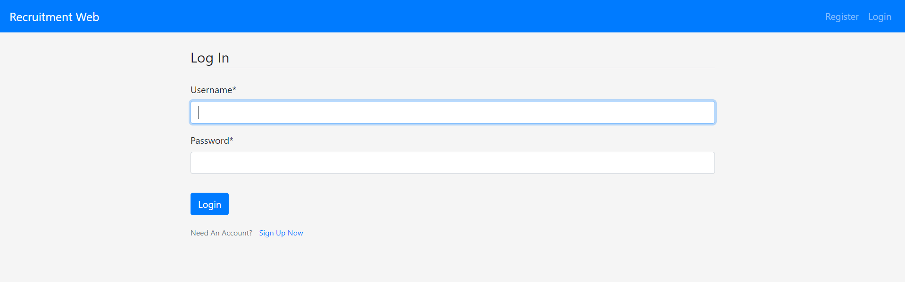

# Django-Project

## Introduction

This repository contains the source code for Recruitment website, which is built in Django (Python Web Framework).

This Project contain 3 Apps (modules):
1. **Candidate** : Which manage all the candidates data.
2. **Dashboard** : It is used to display candidates data, manage candidates data (Update or Delete)
3. **Users** : Through this module user can register, login, logout and can access their profiles.

## Prerequisites

For this project i used mysql database and other different libraries so first you have to install necessary libraries

1. Create `py_new_project` empty database in your computer using XAMPP/WAMP Server for that.
2. Install Crispy-forms using `pip install django-crispy-forms`
3. Install Mysqlclient using `pip install mysqlclient`.
4. Then go to the Project directory and run following commands in sequence
5. `python manage.py makemigrations` For migrations
6. `python manage.py migrate` to reflect models in databases
7. `python manage.py runserver` to run the project

## Features

1. New User can register, login, logout and also he/she can modify their profiles.

2. Each user can separetly manage their own candidates Data through Dashboard and Add candidate modules.

